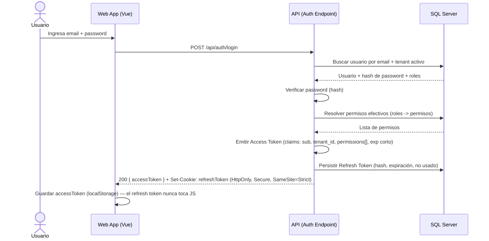
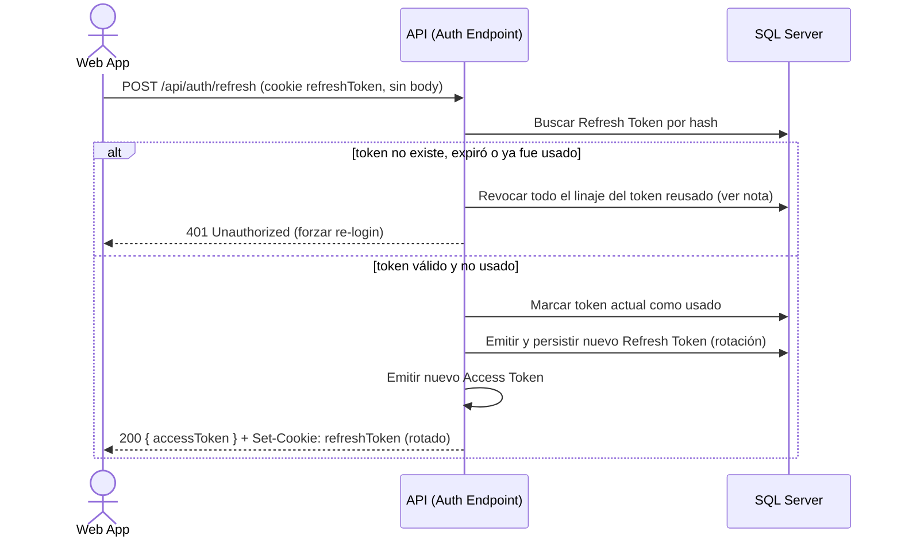
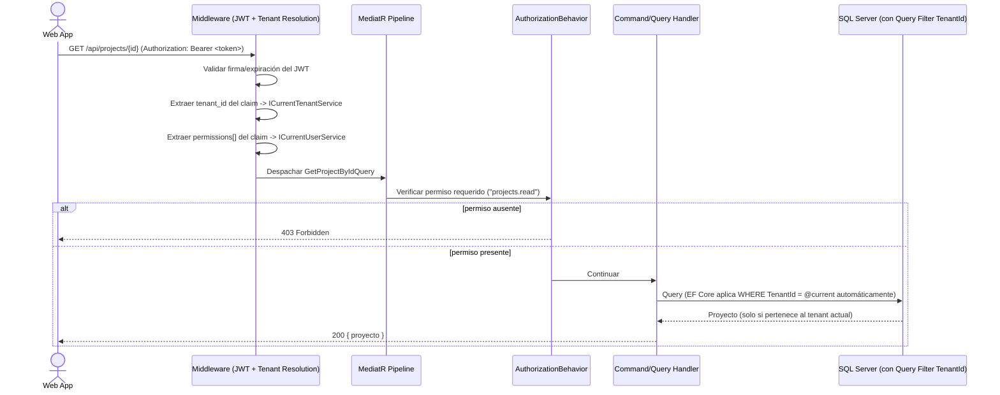
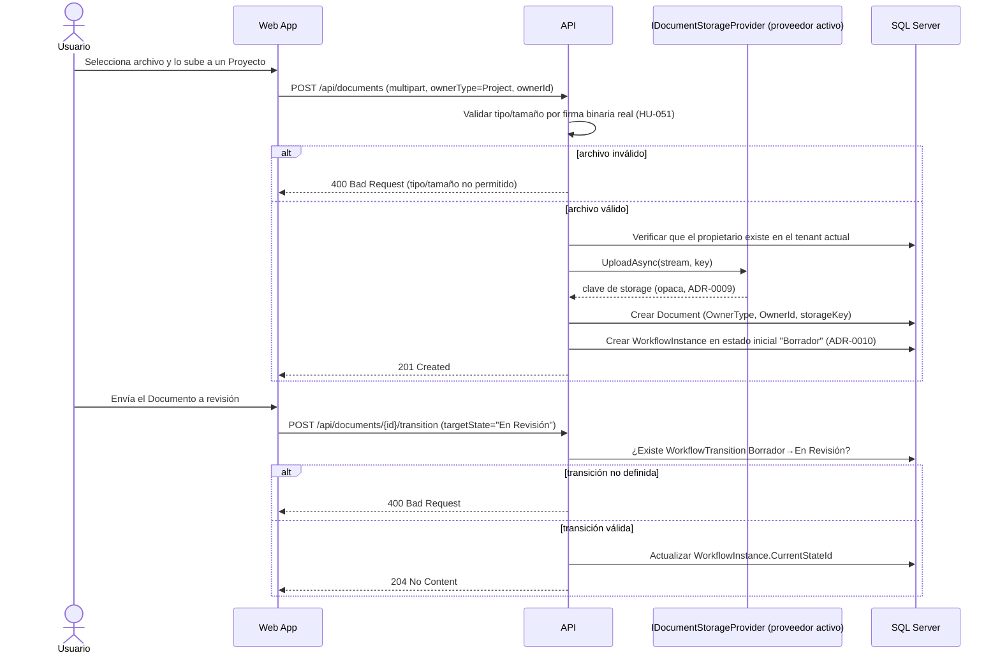
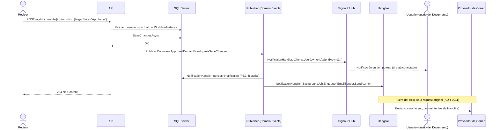
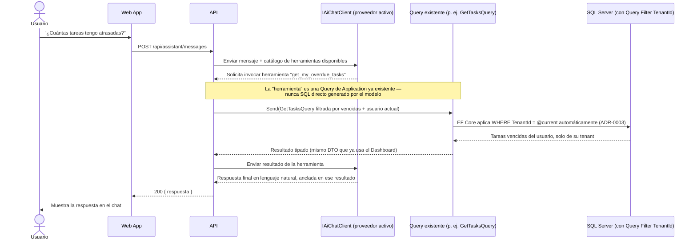
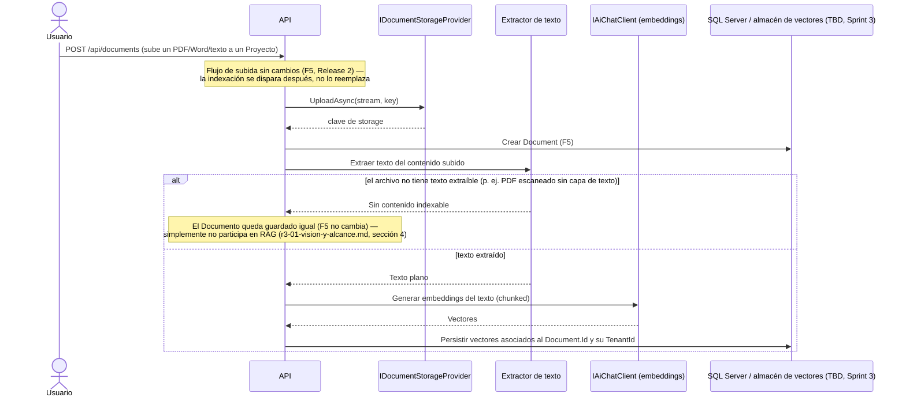
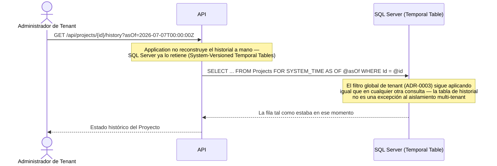

# Diagramas de Secuencia — Flujos Críticos

## 1. Login con emisión de JWT + Refresh Token (HU-002)

Nota: los permisos se "aplanan" en el Access Token en el momento del login para
evitar una consulta a base de datos en cada request subsecuente. Trade-off
documentado en ADR-0004: si los permisos de un usuario cambian mientras su
token sigue vigente, el cambio no se refleja hasta el siguiente refresh —
mitigado con una vida corta del Access Token (minutos, no horas).

Actualizado 2026-07-07: el diagrama original (Sprint 2) ya mostraba el
refresh token viajando aparte de forma segura; la implementación de Sprint 7a
lo devolvía en el mismo body JSON que el access token, y el frontend lo
guardaba en `localStorage`. La revisión de seguridad ad-hoc de esa fecha lo
corrigió a cookie `HttpOnly` — ver [ADR-0007](../adr/ADR-0007-refresh-token-en-cookie-httponly.md).

## 2. Renovación de sesión (Refresh Token con rotación)

La rotación con detección de reuso (si un Refresh Token ya marcado "usado" se
presenta de nuevo, se revocan todos los tokens de la familia) es la mitigación
estándar contra robo de Refresh Token — se implementa así en vez de un
Refresh Token estático de larga duración.

Nota (2026-07-07): este diagrama ya documentaba desde Sprint 2 que el reuso
debía revocar "todos los tokens de la familia" — la implementación de
Sprint 7a revocaba solo el token reusado, no su cadena de descendientes,
divergiendo silenciosamente del diseño. Corregido en la revisión de seguridad
ad-hoc; ver [docs/08a-seguridad.md](../08a-seguridad.md), hallazgo #5.

## 3. Request autenticada: resolución de tenant + autorización por permiso

Punto de diseño central: **el filtrado por tenant no depende de que cada
handler recuerde añadir `WHERE TenantId = ...`** — se aplica como Global Query
Filter en `AppDbContext` (ver ADR-0003), de modo que olvidarlo en un handler
nuevo no puede filtrar datos entre tenants. Es un control a nivel de
infraestructura, no una convención de código que dependa de disciplina humana.

## 4. Subida de Documento + transición de Workflow (HU-050, HU-081) — Release 2

Mismo patrón de "hecho inyectado" que el diagrama 3 usa para autorización:
`Document.TransitionTo(...)` nunca decide *si puede* transicionar consultando
otro agregado directamente — recibe el resultado de esa consulta ya resuelto
por `Application` (ADR-0010).

## 5. Notificación in-app + correo tras aprobar un Documento (HU-060, HU-061) — Release 2

Los tres efectos (in-app, historial, correo) son handlers independientes del
mismo evento — ninguno depende de que los otros dos tengan éxito (ADR-0011).
La respuesta al Revisor (`204 No Content`) no espera al envío de correo.

## 6. Pregunta al asistente de IA con tool-use (HU-092) — Release 3

Punto de diseño central (mismo principio que el diagrama 3 aplica a
autorización, y el 4 a Workflow): el modelo de IA **nunca decide qué datos
ver por sí mismo** — solo puede invocar herramientas que son, una a una,
Queries de Application que ya pasan por `AuthorizationBehavior` y el filtro
de tenant. No existe una ruta donde el modelo reciba un `IAppDbContext` o
genere SQL — la superficie de "lo que el asistente puede consultar" es
exactamente la superficie de Queries que Application ya expone a cualquier
otro caller, ni un bit más.

## 7. Indexación de un Documento para RAG (HU-100) — Release 3

El `TenantId` viaja con cada vector indexado por la misma razón que
cualquier otra fila del sistema (ADR-0003) — cuando el asistente responda
preguntas ancladas en Documentos (HU-101), la búsqueda de similitud debe
filtrar por tenant *antes* de devolver resultados al modelo, nunca después
de generar la respuesta.

## 8. Consultar el historial de cambios de un Proyecto (HU-102) — Release 4

La retención de versiones es responsabilidad de SQL Server, no de código
de aplicación — `AppDbContext` sigue leyendo/escribiendo la tabla
`Projects` igual que siempre; `FOR SYSTEM_TIME AS OF` es una cláusula SQL
adicional que EF Core traduce vía `.TemporalAsOf(date)`, no un mecanismo
paralelo que Application tenga que mantener sincronizado a mano.
