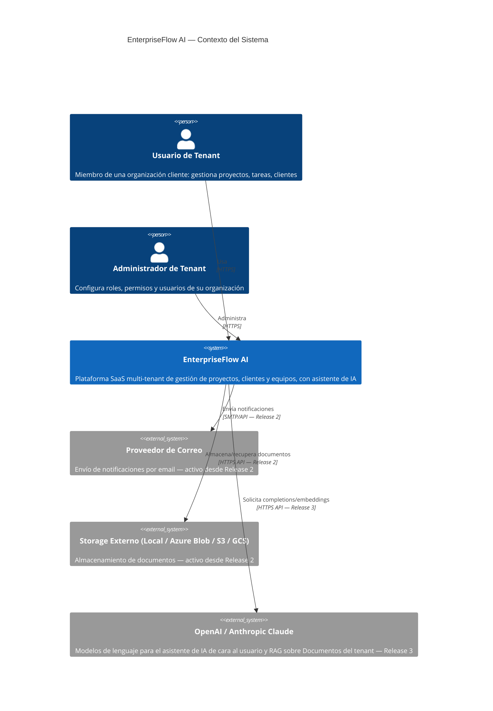

# C4 — Nivel 1: Diagrama de Contexto

Alcance: sistema completo (incluye elementos de Releases futuros, marcados
como tal, para que el contexto no quede desactualizado cuando se implementen).

## Notas de alcance

**Release 1 (histórico)**: los únicos actores activos eran **Usuario** y
**Administrador de Tenant**, sin dependencias externas reales (no había envío
de correo, storage externo ni proveedores de IA).

**Release 2 (activo)**: el sistema gana sus primeras dos dependencias
externas reales — **Proveedor de Correo** (Notificaciones, F6.2) y
**Storage Externo** (Documentos, F5), con el proveedor de storage
seleccionable por configuración entre Local/Azure/S3/GCS (ver
`r2-01-vision-y-alcance.md`). Redis y Hangfire (ADR-0008) no aparecen como
`System_Ext` en este diagrama porque no son sistemas externos al producto —
son contenedores propios de EnterpriseFlow AI, visibles en el nivel de
Contenedores (`c4-02-contenedores.md`), no en el de Contexto.

**Release 3 (Sprint 2, Diseño)**: `aiProviders` (OpenAI/Anthropic) se
mantiene en el diagrama como la única dependencia externa nueva — se
implementa cuando llegue su Release. El actor "Cliente MCP" que aparecía
aquí antes de este sprint se quitó: el plan original de Release 3 incluía
un servidor MCP propio expuesto a agentes externos, redefinido en el
Sprint 1 de Análisis hacia un asistente de cara al usuario final (ver
`r3-01-vision-y-alcance.md`, sección 0) — el servidor MCP queda diferido
sin Release asignado (`backlog/epics.md`, E11), así que no tiene sentido
seguir mostrándolo como parte del contexto activo de este Release.

El elemento `System_Ext` marcado "Release 3" se mantiene en el diagrama
para que sirva como mapa completo del producto, pero **no se implementa la
integración contra él hasta su Sprint correspondiente** — evita construir
un adaptador para un sistema externo que aún no tiene un consumidor real
(YAGNI, ver ADR-0001).

**Release 4 (Sprint 2, Diseño): sin cambios en este diagrama.** Ninguna
pieza del alcance confirmado de Release 4 (Temporal Tables, OpenTelemetry
con exportador local, BenchmarkDotNet, CodeQL, Dependabot, Semantic
Versioning) introduce una dependencia externa al *runtime* del producto —
Temporal Tables vive dentro del mismo SQL Server ya modelado, y
CodeQL/Dependabot corren en tiempo de CI, no en tiempo de ejecución del
sistema, así que no les corresponde un `System_Ext` aquí (un diagrama C4
de Contexto describe la arquitectura en ejecución, no el pipeline de
build). Elastic/Application Insights (diferido, `r4-01-vision-y-alcance.md`
sección 0) sí habría sido un `System_Ext` nuevo — se documenta la
decisión de no agregarlo todavía en vez de agregarlo "por si acaso".
