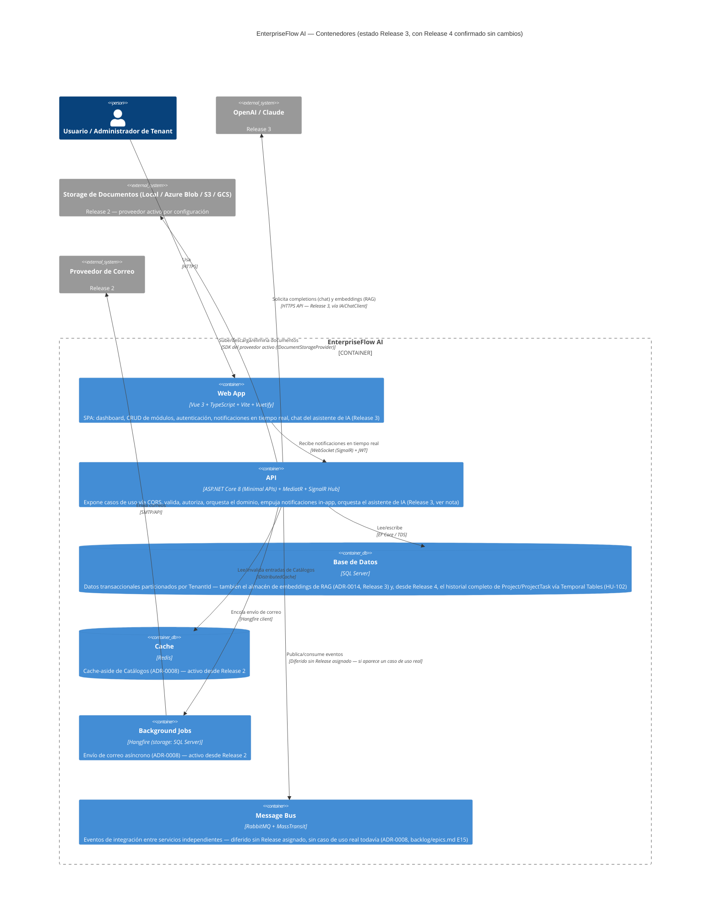

# C4 — Nivel 2: Diagrama de Contenedores

## Decisiones reflejadas en este diagrama

- **Un único contenedor API** (no microservicios), sigue vigente en Release 2.
  Justificación original (ADR-0001) sin cambios: ningún módulo nuevo de
  Release 2 tiene una frontera de negocio que justifique el costo operativo
  de separarlo en un servicio independiente — Documentos/Notificaciones/
  Workflow/Catálogos son Vertical Slices más dentro del mismo monolito
  modular, no servicios nuevos.
- **SignalR vive dentro del contenedor `api`, no es un contenedor propio** —
  a diferencia de Redis/Hangfire (procesos externos independientes), un Hub
  de SignalR corre in-process con ASP.NET Core por defecto; solo se separaría
  como pieza de infraestructura propia si se adoptara Azure SignalR Service
  para escalar horizontalmente (esa es exactamente la distinción de "SignalR
  a escala" que sigue diferida a Release 4, ver `02-roadmap.md`).
- **Redis y Hangfire pasan de "futuro" a "activo" en este Release** — cada
  uno atado a un caso de uso real de Release 2, no a la lista de la
  especificación original (ADR-0008 tiene el detalle completo, incluyendo por
  qué Hangfire usa SQL Server como storage en vez de introducir una pieza de
  infraestructura adicional).
- **RabbitMQ + MassTransit siguen diferidos** — Release 2 no introduce
  ningún consumidor de eventos fuera del propio proceso de la Api (Hangfire
  ya resuelve "trabajo asíncrono dentro del mismo proceso"), así que un
  message bus completo seguiría siendo infraestructura sin caso de uso real
  (mismo criterio de ADR-0001/ADR-0008).
- **Release 3 (Sprint 2, Diseño): el asistente de IA y RAG viven dentro del
  contenedor `api` existente, no en contenedores propios.** Antes de este
  sprint, el diagrama tenía un contenedor `mcp` (Servidor MCP) y un
  contenedor `rag` (Motor RAG) separados — reflejaban el plan original de
  Release 3 (tooling de desarrollo con un servidor MCP de protocolo y ciclo
  de vida propios). Redefinido el alcance en el Sprint 1 de Análisis hacia
  un asistente de cara al usuario final (`r3-01-vision-y-alcance.md`), el
  servidor MCP queda diferido sin Release asignado — se quitó del diagrama
  por completo, no solo marcado "futuro" (ya no es parte del plan de ningún
  Release concreto). RAG, redirigido a indexar Documentos del tenant en vez
  de la documentación del propio proyecto, deja de necesitar un proceso
  propio con ciclo de vida distinto: es una Vertical Slice más dentro del
  mismo monolito modular, mismo argumento que ya aplica a Documentos/
  Workflow/Notificaciones/Catálogos (Release 2) — ni el chat ni la
  indexación tienen una frontera de negocio o un patrón de escalado que
  justifique el costo operativo de un servicio aparte.
- **El almacén de vectores para RAG no se decide en este Sprint** — el
  diagrama lo deja apuntando tentativamente a la misma Base de Datos ya
  existente (SQL Server), pero esa es una decisión de Arquitectura (Sprint
  3), no de Diseño: depende de una comparación real de alternativas que
  `r3-01-vision-y-alcance.md` (sección 3) ya señaló como pendiente para esa
  fase.
- **Release 4 (Sprint 2, Diseño): confirmado que no hace falta ningún
  contenedor nuevo.** Temporal Tables (HU-102) es una capacidad del mismo
  `db` ya modelado, no una pieza de infraestructura aparte — se anotó en
  su descripción arriba. OpenTelemetry corre in-process dentro de `api`
  con un exportador local (sin backend real detrás, `r4-01-vision-y-alcance.md`
  sección 3) — no introduce un contenedor "Collector" propio en este
  Release, mismo criterio que ya evitó separar SignalR en su propio
  contenedor. BenchmarkDotNet es un proyecto de consola que se corre
  on-demand, no un servicio en ejecución — no le corresponde un lugar en
  este diagrama. CodeQL/Dependabot/Semantic Versioning corren en CI, fuera
  del sistema en ejecución que este diagrama describe. El contenedor `bus`
  (RabbitMQ) sigue diferido, ahora con su propia entrada de trazabilidad
  en `backlog/epics.md` (E15, agregado al iniciar Release 4).
