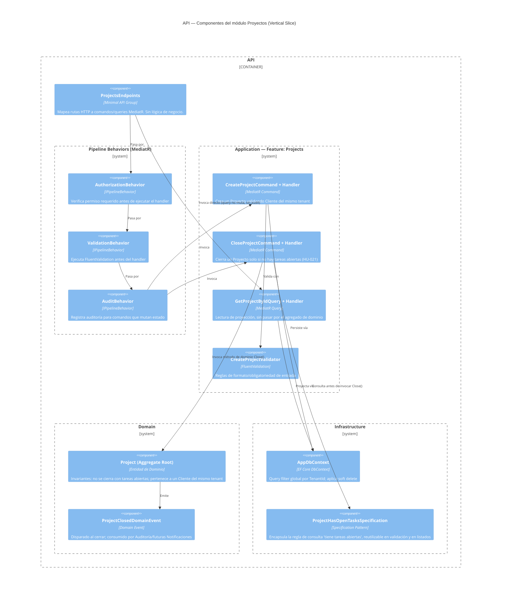

# C4 — Nivel 3: Componentes del contenedor API (módulo Proyectos)

Vista de componentes dentro del contenedor **API**, usando el módulo
**Proyectos** como representativo de la plantilla de Vertical Slice que
siguen también Empresas, Clientes, Contactos, Equipos, Tareas y Calendario
(ver justificación en `00-resumen.md`).

## Decisiones clave de este componente

**¿Por qué `GetProjectByIdQuery` no pasa por `AuditBehavior` ni por el
agregado de dominio?**
Las lecturas no mutan estado ni tienen invariantes que proteger; forzarlas a
pasar por el Aggregate Root y por un behavior de auditoría sería trabajo sin
propósito (CQRS: las queries proyectan directamente contra `DbContext`,
devolviendo DTOs de solo lectura). Esto es consistente con la sección
`REGLAS` del documento original ("no generar código duplicado"): un mismo
pipeline no debe forzarse sobre operaciones con necesidades distintas.

**¿Por qué existe `ProjectHasOpenTasksSpecification` (Specification Pattern)
pero no un `IProjectRepository` genérico?**
La regla de negocio "¿tiene tareas abiertas?" se necesita en dos lugares
(validar el cierre en `CloseProjectCommand`, y potencialmente en un badge de UI
"no se puede cerrar"). Encapsularla como Specification evita duplicar la
query LINQ en dos handlers. Un repositorio genérico `IProjectRepository` con
métodos `GetById/Add/Update` por encima de EF Core no añadiría nada que
`DbContext` no dé ya — sería la abstracción redundante que ADR-0001 (sección 5)
descarta explícitamente para agregados sin necesidad real de desacoplo de EF
Core.

**¿Por qué un Domain Event (`ProjectClosedDomainEvent`) en el MVP si
Notificaciones es Release 2?**
El evento se define y se dispara ahora (es parte del comportamiento correcto
del agregado `Project`), pero en Release 1 su único subscriber es
`AuditBehavior`/registro interno. Cuando Notificaciones (Release 2) exista,
se añade un nuevo handler suscrito al mismo evento — sin modificar el
agregado de dominio ni el `CloseProjectCommand`. Este es el punto donde Clean
Architecture paga: el dominio ya está listo para nuevos consumidores del
evento sin cambios.
