# Sprint 5 — Modelo de Dominio

Alcance: únicamente `EnterpriseFlow.Domain` — entidades, invariantes, eventos
de dominio. Sin configuración de EF Core, sin migraciones, sin Handlers ni
endpoints (eso es Sprint 6 y 7). Cada invariante está cubierta por
`EnterpriseFlow.Domain.UnitTests` (30 pruebas, ninguna con dependencias de
infraestructura).

## Diagrama de clases (agregados del MVP)

```mermaid
classDiagram
    class Company {
        +string Name
        +string? TaxId
    }

    class Client {
        +string Name
        +Guid? CompanyId
        +Deactivate()
    }

    class Contact {
        +string Name
        +string? Email
        +string? Phone
        +Guid ClientId
    }

    class Project {
        +string Name
        +Guid ClientId
        +DateOnly? StartDate
        +DateOnly? EstimatedEndDate
        +ProjectStatus Status
        +Close(bool hasOpenTasks)
        +AddMember(Guid userId, ProjectRole role)
        +RemoveMember(Guid userId)
        +IsMember(Guid userId) bool
    }

    class ProjectMember {
        +Guid ProjectId
        +Guid UserId
        +ProjectRole Role
    }

    class ProjectTask {
        +string Title
        +string? Description
        +TaskPriority Priority
        +ProjectTaskStatus Status
        +Guid ProjectId
        +Guid? AssignedToUserId
        +DateOnly? DueDate
        +bool IsOpen
        +AssignTo(Guid userId, bool isProjectMember)
        +Start()
        +Complete()
        +Cancel()
    }

    Client "0..1" --> "0..*" Company : CompanyId
    Contact "1" --> "1" Client : ClientId
    Project "1" --> "1" Client : ClientId
    Project "1" *-- "0..*" ProjectMember : team
    ProjectTask "1" --> "1" Project : ProjectId
```

Nota: las flechas `-->` (asociación por id, no navegación de objeto) son
deliberadas — `Contact.ClientId`, `Project.ClientId` y `ProjectTask.ProjectId`
son valores planos (`Guid`), no propiedades de navegación EF Core. Cada
entidad solo "conoce" el id de lo que referencia fuera de su propio agregado,
nunca el objeto — así se refuerza la frontera de agregado también en el
modelo de datos, no solo en la documentación.

## Por qué `Project` no es dueño de sus `ProjectTask`

Ver [ADR-0005](./adr/ADR-0005-invariantes-cross-aggregate.md). En resumen:
tareas tienen su propio ciclo de vida (tenant, auditoría, soft-delete propios,
se editan independientemente y en volumen), así que forzarlas dentro del
agregado `Project` obligaría a cargar todas las tareas de un proyecto para
editar solo una. `Project` sí es dueño de `ProjectMember` (el equipo) porque
la membresía es pequeña, cambia poco y su única invariante (sin duplicados)
requiere ver la colección completa de todas formas.

## Trazabilidad Historia de Usuario → invariante de dominio

| Historia | Invariante | Dónde vive | Prueba |
|---|---|---|---|
| HU-010 | Empresa se desactiva con soft delete, no borrado físico | `Company.MarkDeleted` | `CompanyTests.MarkDeleted_*` |
| HU-012 | Contacto requiere un Cliente válido; desactivar Cliente cascada a Contactos | `Contact.Create` (guard), `Client.Deactivate` + `ClientDeactivatedDomainEvent` | `ContactTests.Create_Without_ClientId_Throws`, `ClientTests.Deactivate_*` |
| HU-021 | Proyecto no cierra con tareas abiertas | `Project.Close(bool hasOpenTasks)` | `ProjectTests.Close_With_Open_Tasks_Throws_*` |
| HU-022 | Un usuario no puede repetirse en el equipo de un proyecto | `Project.AddMember` | `ProjectTests.AddMember_Same_User_Twice_Throws` |
| HU-023 | Una tarea solo se asigna a un miembro del equipo del proyecto | `ProjectTask.AssignTo(Guid, bool)` | `ProjectTaskTests.AssignTo_Non_Member_Throws` |

## Decisiones menores de este sprint

- **Enums simples** (`ProjectStatus`, `ProjectTaskStatus`, `TaskPriority`,
  `ProjectRole`) en vez de un patrón "smart enum"/Value Object con
  comportamiento: ninguno de estos valores tiene lógica asociada más allá de
  la propia transición de estado ya modelada en los métodos del agregado —
  añadir una clase por cada uno sería la abstracción prematura que ADR-0001
  ya descarta como criterio general.
- **`ProjectTaskStatus` y `ProjectTask`** se nombraron explícitamente para no
  colisionar con `System.Threading.Tasks.Task`/`TaskStatus` del BCL — un
  conflicto de nombres real, no cosmético, que habría forzado alias en cada
  archivo que también use `Task` asíncrono (que son casi todos).
- **`ProjectMember.Create` es `internal`**: solo `Project` (mismo assembly)
  puede construir miembros, reforzando que la única forma válida de añadir un
  miembro es `Project.AddMember`, nunca instanciar `ProjectMember` suelto
  desde Application.
- **Calendario (HU-024) no tiene entidad de dominio propia.** Es una
  proyección de lectura (tareas/proyectos por fecha), no un agregado con
  invariantes — se construye en Sprint 7 como una query, no como un modelo.
  Inventar una entidad para esto habría sido modelar una pantalla, no un
  concepto de negocio.

## Qué faltaba (a propósito) para Sprint 6/7 — resuelto desde entonces

- Configuración EF Core e índices, generalización del query filter
  multi-tenant, migraciones: Sprint 6, ver [docs/06-base-de-datos.md](./06-base-de-datos.md).
- Handlers CQRS y endpoints reales: Sprint 7b, ver [docs/07b-modulos-negocio.md](./07b-modulos-negocio.md).
- El diagrama de clases de arriba sigue con el alcance original de este
  Sprint 5 (los 6 agregados de negocio del MVP) — las entidades de Identidad
  (`Tenant`/`User`/`Role`/`RolePermission`/`UserRoleAssignment`/`RefreshToken`,
  Sprint 7a) tienen su propio modelo en [docs/07a-identidad.md](./07a-identidad.md)
  y su diagrama ER en [docs/06-base-de-datos.md](./06-base-de-datos.md), no se
  retrofitearon aquí para no mezclar el alcance de dos sprints en un mismo
  diagrama.
