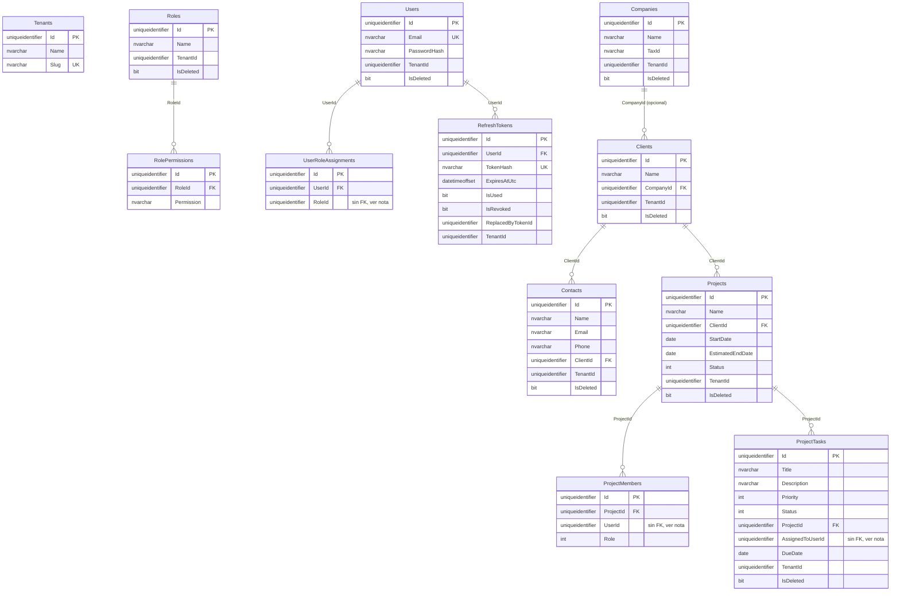
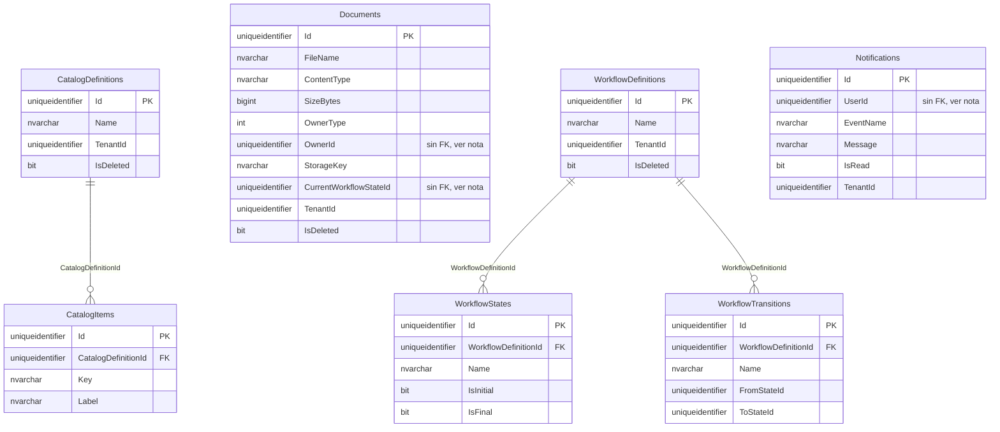
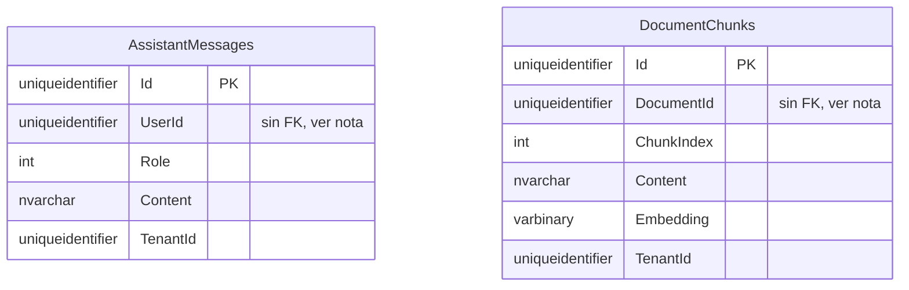

# Sprint 6 — Base de Datos

Alcance: esquema SQL Server para las 6 entidades del MVP, migraciones EF Core,
índices, y la generalización (ya verificada) del filtro multi-tenant +
soft-delete a todas ellas. Seed data se trata explícitamente al final — hay
menos de lo que el nombre del sprint sugiere, por una razón concreta.

## Esquema (diagrama ER)

> Actualizado en Sprint 10 (Documentación) para reflejar el esquema real tras
> Sprint 7a (Identidad) — el diagrama original de este Sprint 6 solo tenía las
> 6 tablas de negocio; las 6 tablas de Identidad (`Tenants`/`Users`/`Roles`/
> `RolePermissions`/`UserRoleAssignments`/`RefreshTokens`) se añadieron después
> y habían quedado documentadas solo en `docs/07a-identidad.md`, no aquí.

`UserRoleAssignments.RoleId`, `ProjectMembers.UserId` y
`ProjectTasks.AssignedToUserId` **siguen sin FK real** — no porque `Users`
no exista (ya existe desde Sprint 7a), sino por decisión deliberada de
ADR-0005 (invariantes cross-aggregate): `User`, `Project` y `Role` son
agregados independientes entre sí, y una FK física entre agregados obligaría
a cargarlos juntos o a coordinar transacciones entre ellos, rompiendo el
límite de agregado que ADR-0002/ADR-0005 establecen a propósito. La
integridad referencial para estos tres casos se garantiza a nivel de
aplicación (los validadores de cada comando verifican que el `Guid`
referenciado exista antes de guardar), no a nivel de base de datos — un
trade-off explícito, no un olvido.

## Esquema — Release 2

Agregado en Sprint 4 (Catálogos) y Sprint 6 (Documentos, Workflow,
Notificaciones) de Release 2 — diagrama separado del de arriba por
legibilidad (19 tablas en un solo diagrama deja de ser útil), no porque sea
un esquema distinto: es la misma base de datos.

`Documents.OwnerId` (polimórfico — puede ser un `Projects.Id`, `Clients.Id`
o `ProjectTasks.Id` según `OwnerType`, ADR-0009),
`Documents.CurrentWorkflowStateId` (referencia a `WorkflowStates.Id`,
ADR-0010) y `Notifications.UserId` (referencia a `Users.Id`) **no tienen FK
real**, mismo trade-off ya explicado arriba para `ProjectMembers.UserId` —
agregados independientes, integridad referencial validada en Application, no
en la base de datos. `WorkflowTransitions.FromStateId`/`ToStateId` tampoco
tienen FK física pese a referenciar `WorkflowStates` de la *misma* fila de
`WorkflowDefinitions` — la invariante ("ambos estados pertenecen a este
Workflow") ya la garantiza `WorkflowDefinition.AddTransition` en memoria
antes de guardar (Sprint 5), y expresarla como FK real habría exigido una FK
compuesta contra `(WorkflowDefinitionId, Id)` en `WorkflowStates` en vez de
solo `Id` — complejidad de esquema que el chequeo en Domain ya cubre.

## Esquema — Release 3

Agregado en Sprint 4 (`AssistantMessages`) y Sprint 6 (`DocumentChunks`) de
Release 3 — diagrama separado por la misma razón de legibilidad que ya
justificó separar el de Release 2.

Ninguna de las dos tiene relaciones dibujadas hacia otras tablas del
esquema: `AssistantMessages.UserId` (referencia a `Users.Id`, mismo
trade-off que `Notifications.UserId`) y `DocumentChunks.DocumentId`
(referencia a `Documents.Id`, mismo trade-off que `Documents.OwnerId`) son
ambas referencias cross-aggregate sin FK física — agregados
independientes, integridad referencial validada en Application, no en la
base de datos (ADR-0005/ADR-0009, aplicado aquí sin ninguna razón nueva
que agregar a lo ya documentado arriba).
`DocumentChunks.Embedding` es un vector de embeddings serializado como
`varbinary(max)` (ADR-0014) — una tabla más de SQL Server, no un servicio
de vectores dedicado; la búsqueda de similitud se calcula en código de
Application sobre las filas ya filtradas por `TenantId`, nunca en la base
de datos misma.

## Historial de cambios (Temporal Tables) — Release 4

`Projects` y `ProjectTasks` (Sprint 4, HU-102, ADR-0015) son
System-Versioned Temporal Tables — SQL Server mantiene automáticamente
`ProjectsHistory`/`ProjectTasksHistory` con una fila por cada versión
anterior de cada registro, más dos columnas ocultas por tabla
(`PeriodStart`/`PeriodEnd`, `datetime2`) que EF Core agrega y administra
por su cuenta. Ninguna entidad de Domain ni configuración manual de
columnas — se activa con una sola línea en la configuración de EF Core
(`builder.ToTable("Projects", tb => tb.IsTemporal())`), verificado con
`SELECT ... FROM sys.tables WHERE temporal_type = 2` contra LocalDB real
(`r4-04-validacion.md`). El resto de las 24 tablas del sistema no son
temporales — activada solo donde HU-102 la pidió, mismo criterio que ya
aplicó Redis/Hangfire únicamente a Catálogos/Correo (ADR-0008) en vez de
a todo el sistema.

## Generalización del filtro multi-tenant + soft-delete

`AppDbContext` (Sprint 4) aplicaba el query filter a mano, solo para
`Company`. Con 6 entidades ahora, se generalizó vía reflexión sobre las
interfaces marcador `ITenantScoped`/`ISoftDeletable` — la misma idea que se
había intentado y abandonado en Sprint 4 por una sospecha (incorrecta) de que
rompía el "re-bind" de instancia de EF Core.

Esta vez se verificó antes de confiar en el mecanismo:
`MultiTenantQueryFilterTests` (en `EnterpriseFlow.Api.IntegrationTests`) crea
dos `AppDbContext` con tenants distintos sobre la misma base SQLite y confirma
que **tanto `Company` como `Client`** quedan aislados correctamente de forma
simultánea. Esto confirma que el mecanismo genérico funciona para múltiples
tipos de entidad, no solo para el caso ya probado — la sospecha de Sprint 4
resultó ser incorrecta (la causa real de aquel fallo fue una omisión en el
wiring de tests, documentada en `04-validacion-arquitectura.md`), pero no se
dio por sentado: se verificó de nuevo con una prueba dedicada antes de
generalizar a 5 entidades más.

## Índices

Cada índice se añadió con un propósito de consulta concreto, no "por si
acaso":

| Tabla | Índice | Para qué |
|---|---|---|
| Companies | `(TenantId, Name)` | Listados/búsqueda por nombre dentro de un tenant — fila faltante encontrada en la auditoría de Sprint 10 de Release 2, el índice ya existía en código desde Sprint 4 de Release 1 |
| Clients | `(TenantId, Name)` | Listados/búsqueda por nombre dentro de un tenant |
| Clients | `CompanyId` | Filtrar clientes de una Empresa |
| Contacts | `ClientId` | Cargar contactos de un Cliente |
| Projects | `(TenantId, Name)` | Listados/búsqueda de proyectos |
| Projects | `ClientId` | Proyectos de un Cliente |
| ProjectMembers | `(ProjectId, UserId)` único | Refuerza a nivel de BD la invariante "sin miembros duplicados" (HU-022) — defensa en profundidad además de la revisada en memoria por `Project.AddMember` |
| ProjectTasks | `ProjectId` | Tareas de un Proyecto (usado por el chequeo de HU-021) |
| ProjectTasks | `AssignedToUserId` | "Mis tareas" (Dashboard, Calendario) |
| ProjectTasks | `(TenantId, Status)` | Indicador de tareas vencidas/abiertas del Dashboard (F4.1) sin table scan |
| Tenants | `Slug` único | `RegisterTenantCommandHandler` resuelve/valida el tenant por slug (HU-001) |
| Users | `Email` único | Login resuelve el usuario solo por email, sin tenant (ADR-0006) — debe ser único en toda la plataforma, no por tenant |
| Roles | `(TenantId, Name)` | Listados de roles dentro de un tenant |
| RolePermissions | `(RoleId, Permission)` único | Refuerza a nivel de BD "un rol no puede tener el mismo permiso dos veces" — mismo patrón de defensa en profundidad que `ProjectMembers` |
| UserRoleAssignments | `(UserId, RoleId)` único | Refuerza a nivel de BD "un usuario no puede tener el mismo rol dos veces" |
| RefreshTokens | `TokenHash` único | Cada `RefreshAccessTokenCommandHandler`/`LogoutCommandHandler` busca el token por hash exacto (HU-002) |
| CatalogDefinitions | `(TenantId, Name)` único | Un tenant no puede tener dos catálogos con el mismo nombre — mismo patrón que `Roles` |
| CatalogItems | `(CatalogDefinitionId, Key)` único | Refuerza a nivel de BD "sin claves duplicadas dentro de un catálogo" (HU-082) — defensa en profundidad además de `CatalogDefinition.AddItem` |
| Documents | `(TenantId, OwnerType, OwnerId)` | "Documentos de este Proyecto/Cliente/Tarea" — la pestaña Documentos de una página de detalle (HU-050) |
| Notifications | `(TenantId, UserId, IsRead)` | "Mis notificaciones, leídas y no leídas" (HU-062) — el único patrón de lectura real del centro de notificaciones |
| WorkflowDefinitions | `(TenantId, Name)` único | Mismo patrón que `Roles`/`CatalogDefinitions` |
| WorkflowTransitions | `(WorkflowDefinitionId, FromStateId, ToStateId)` único | Refuerza a nivel de BD "sin transiciones duplicadas entre el mismo par de estados" (HU-080) — defensa en profundidad además de `WorkflowDefinition.AddTransition` |
| AssistantMessages | `(TenantId, UserId, CreatedAtUtc)` | "Mi historial de conversación, en orden" (HU-091) — el único patrón de lectura real |
| DocumentChunks | `(TenantId, DocumentId)` | Recuperación de RAG (escaneo de los chunks de un tenant, HU-101) y limpieza/re-indexación de los chunks de un Documento específico |

## Auditoría y soft delete

Sin cambios de mecanismo respecto a Sprint 4: el mismo
`AuditableEntitySaveChangesInterceptor` estampa `TenantId`/auditoría y
convierte deletes físicos en soft-delete para **cualquier** entidad que
implemente los marcadores correspondientes — las 5 entidades nuevas los
implementan, así que quedan cubiertas sin tocar el interceptor.

## Seed data: menos de lo que el nombre sugiere, y por qué

La especificación original pide "Seed Data" como parte de la base de datos.
En este punto del proyecto, sin embargo, **no existe todavía ningún dato de
referencia real que sembrar**:

- Los catálogos de la aplicación (`ProjectStatus`, `TaskPriority`, etc.) son
  enums de C#, no tablas — no hay filas que insertar.
- El catálogo de permisos (`Permissions.Companies.*`) también es código, no
  una tabla `Permissions`/`RolePermissions` — esas tablas no existen hasta
  Sprint 7 (E1, Identidad), que es cuando "seed data" cobra sentido real
  (roles por defecto, mapeo rol→permiso, un tenant/usuario administrador
  inicial).
- Empresas/Clientes/Proyectos/Tareas son datos transaccionales creados por el
  usuario, no datos de referencia — poblarlos con registros de ejemplo
  "porque sí" sería generar datos de demo disfrazados de seed data, y no se
  hace hasta que exista una razón real (p. ej. un ambiente de demo para el
  portafolio, que se abordará explícitamente si se pide, no como parte de este
  sprint).

Se documenta esto en vez de forzar un `HasData(...)` vacío de contenido solo
para marcar la casilla "Seed Data" — sería trabajo sin propósito real, que las
reglas del proyecto (`especificcion.md`, sección REGLAS) piden evitar.

## Qué se resolvió después (Sprint 7a)

Lo que este Sprint 6 dejaba pendiente para Sprint 7 (Backend) — actualizado
aquí en Sprint 10 en vez de dejarlo como una lista desactualizada:

- Tablas de Identidad (`Tenants`/`Users`/`Roles`/`RolePermissions`/
  `UserRoleAssignments`/`RefreshTokens`) y su seed data real (rol
  "Administrator" con todos los permisos, sembrado por `RegisterTenantCommandHandler`
  al registrar cada tenant — no hay un admin global único, cada tenant tiene
  el suyo). Detalle en [docs/07a-identidad.md](./07a-identidad.md).
- La FK real de `ProjectMembers.UserId`/`ProjectTasks.AssignedToUserId` hacia
  `Users` que este documento daba por pendiente **no se agregó** — al llegar
  el momento, ADR-0005 (invariantes cross-aggregate, ya vigente desde antes
  de Sprint 7a) estableció que una FK física entre agregados independientes
  no es el patrón correcto aquí. Ver la nota bajo el diagrama ER arriba.
- Handlers CQRS + endpoints para Clientes, Contactos, Proyectos, Equipos,
  Tareas — construidos en Sprint 7b, reutilizando el mismo pipeline
  (Authorization + Validation behaviors) ya probado en Sprint 4 para Empresas.
