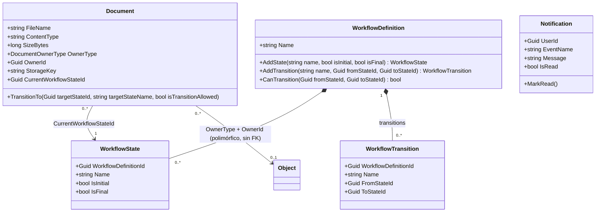

# Release 2, Sprint 5 — Modelo de Dominio

Mismo alcance que Sprint 5 de Release 1: únicamente `EnterpriseFlow.Domain`
— entidades, invariantes, eventos de dominio. Sin configuración de EF Core,
sin migraciones, sin Handlers ni endpoints (Sprint 6 y 7). Cubre las tres
entidades de Release 2 que Sprint 4 (Validación) no necesitó: `Document`
(F5), `WorkflowDefinition`/`WorkflowState`/`WorkflowTransition` (F8.1),
`Notification` (F6.3) — `CatalogDefinition`/`CatalogItem` (F8.2) ya se
construyeron en Sprint 4 como el slice de validación y no se repiten aquí.

## Diagrama de clases

Nota sobre la última relación: `Document.OwnerId` puede apuntar a `Project`,
`Client` o `ProjectTask` según `OwnerType` — no hay un tipo `Object` real en
el modelo, es una forma de expresar "referencia polimórfica sin agregado
fijo" en el diagrama (ADR-0009). Igual que en `05-modelo-dominio.md`, las
flechas `-->` son asociación por id, no navegación de objeto: `Document`
nunca carga un `Project`/`Client`/`ProjectTask` ni un `WorkflowState` como
propiedad de navegación.

## Por qué `WorkflowState`/`WorkflowTransition` son filas, no un enum

Ver [ADR-0010](./adr/ADR-0010-motor-workflow-generico.md) para el detalle
completo. En resumen: a diferencia de `ProjectStatus`/`ProjectTaskStatus`
(Release 1, transiciones fijas en `Project.Close()`/`ProjectTask.Complete()`),
F8.1 exige que un tenant defina o cambie sus propios estados/transiciones
sin una nueva versión de la Api — un enum de C# no puede satisfacer eso por
definición. `Document.TransitionTo` no sabe qué transiciones son válidas;
recibe `isTransitionAllowed` ya resuelto por Application (que sí consultó
`WorkflowDefinition.CanTransition`), mismo patrón de "hecho inyectado" que
`Project.Close(bool hasOpenTasks)` ya estableció en Release 1 (ADR-0005).

## Por qué `Document` no sabe qué transición es "una aprobación"

`Document.TransitionTo` levanta `DocumentWorkflowTransitionedDomainEvent` en
**toda** transición exitosa, no solo cuando el estado destino "significa"
Aprobado/Rechazado — porque `Document` no tiene forma de saberlo: los
nombres de estado son datos configurables por tenant, no valores que Domain
pueda reconocer. El evento lleva `ToStateName` (un hecho inyectado más, igual
que `isTransitionAllowed`) precisamente para que un handler de notificación
futuro (F6, construido en un sprint posterior) decida qué transiciones le
importan, sin que `Document` tenga que codificar esa decisión de negocio.
Decisión explícita para no adelantar trabajo de Application dentro de Domain.

## Trazabilidad Historia de Usuario → invariante de dominio

| Historia | Invariante | Dónde vive | Prueba |
|---|---|---|---|
| HU-050 | Un Documento requiere propietario, tipo de contenido y clave de storage válidos | `Document.Create` (guards) | `DocumentTests.Create_With_Missing_*_Throws` |
| HU-080 | Un Workflow tiene un único estado inicial | `WorkflowDefinition.AddState` | `WorkflowDefinitionTests.AddState_Second_Initial_State_Throws` |
| HU-080 | Una transición solo puede referenciar estados del mismo Workflow | `WorkflowDefinition.AddTransition` | `WorkflowDefinitionTests.AddTransition_With_Unknown_*_Throws` |
| HU-080 | No puede haber dos transiciones entre el mismo par de estados | `WorkflowDefinition.AddTransition` | `WorkflowDefinitionTests.AddTransition_Duplicate_Throws` |
| HU-081 | Un Documento no puede moverse a un estado sin una transición definida | `Document.TransitionTo(Guid, string, bool)` | `DocumentTests.TransitionTo_When_Not_Allowed_Throws_*` |
| HU-062 | Una notificación nace no leída; solo se marca leída explícitamente | `Notification.Create`/`MarkRead` | `NotificationTests.MarkRead_Sets_IsRead` |

## Decisiones menores de este sprint

- **`Notification` sin `ISoftDeletable`**: ninguna HU pide eliminar
  notificaciones, solo leerlas y marcarlas como leídas — agregar soft delete
  especulativamente sería la misma sobre-construcción que ADR-0001 ya
  descarta como criterio general.
- **`WorkflowState`/`WorkflowTransition` con `Create` interno** (no
  `public`), mismo patrón que `RolePermission`/`CatalogItem`: la única forma
  válida de crear uno es a través de `WorkflowDefinition.AddState`/
  `AddTransition`, nunca instanciados sueltos desde Application.
- **Sin una entidad `WorkflowInstance` separada**: `Document` guarda
  `CurrentWorkflowStateId` directamente en vez de referenciar una instancia
  de workflow intermedia — ya decidido en ADR-0010 (Sprint 2); Sprint 5 solo
  lo implementa. Un futuro segundo consumidor del motor (fuera de Release 2)
  reevaluaría esto si necesitara historial de instancia propio más allá del
  estado actual.
- **`DocumentOwnerType` como enum simple**, mismo criterio que
  `ProjectStatus`/`TaskPriority` en Release 1 (05-modelo-dominio.md): sin
  comportamiento propio más allá de discriminar el tipo de propietario, una
  clase por valor sería abstracción prematura.

## Verificación

`EnterpriseFlow.Domain.UnitTests`: 38 pruebas nuevas (`DocumentTests`,
`WorkflowDefinitionTests`, `NotificationTests`), mismo patrón que
`CatalogDefinitionTests` (Sprint 4) — guard clauses, invariantes, ciclo de
vida. Suite completa: **180/180 tests** (122+12+6+40),
`EnterpriseFlow.Architecture.Tests` sigue confirmando que `Domain` no
depende de `Application`/`Infrastructure`/`Api` ni de MediatR/EF Core/
AspNetCore — las tres entidades nuevas no introdujeron ninguna dependencia
prohibida. `dotnet format --verify-no-changes` limpio.
