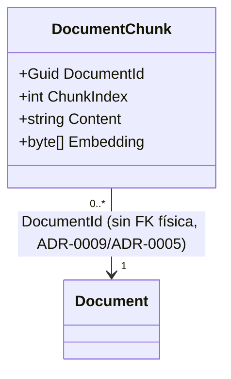

# Release 3, Sprint 5 — Modelo de Dominio

Mismo alcance que Sprint 5 de Release 2: únicamente `EnterpriseFlow.Domain`
— entidades, invariantes, sin configuración de EF Core, sin migraciones, sin
Handlers ni endpoints (Sprint 6 y el Sprint de Backend). `AssistantMessage`
(F9) ya se modeló en Sprint 4 como el slice de validación — este Sprint
cubre lo único que faltaba: `DocumentChunk` (F10, RAG).

## Diagrama de clases

`DocumentChunk` es un aggregate root propio, no un hijo de `Document` — la
flecha es asociación por id, no navegación de objeto (mismo criterio que
`05-modelo-dominio.md` y `r2-05-modelo-dominio.md` ya establecieron para
las demás referencias cross-aggregate del sistema).

## Por qué `DocumentChunk` no es un hijo de `Document`

`WorkflowState`/`WorkflowTransition` (Release 2) SÍ son hijos de
`WorkflowDefinition` porque se crean y mutan dentro de la misma operación
transaccional que su padre. `DocumentChunk` es distinto: indexar el
contenido de un Documento ocurre **después** de subirlo, en una operación
separada (ver el diagrama de secuencia 7 en
`03-diseno-arquitectura/04-secuencias.md`, Sprint 2) — no hay ningún
momento en que `Document` y sus chunks necesiten guardarse atómicamente
juntos. Modelarlo como hijo habría obligado a cargar todos los chunks de
un Documento cada vez que se toca el Documento mismo (p. ej. al
transicionarlo de estado), sin ningún beneficio real. Mismo argumento que
ya separó `ProjectTask` de `Project` en Release 1 (ADR-0005).

## Por qué el cálculo de similitud no vive en esta entidad

ADR-0014 fija que la búsqueda de similitud para RAG se calcula en código
de Application, no en Domain — `DocumentChunk` es la **forma de
almacenamiento** (qué se persiste), no el **algoritmo de recuperación**
(cómo se rankean los resultados para una pregunta). Igual que
`WorkflowDefinition.CanTransition` sí vive en Domain porque es una
invariante de negocio real, comparar vectores de coseno no es una regla de
negocio — es una operación matemática que pertenece al caso de uso que la
necesita (el handler de búsqueda, construido en el Sprint de Backend), no
a la entidad que guarda los datos.

## Trazabilidad Historia de Usuario → invariante de dominio

| Historia | Invariante | Dónde vive | Prueba |
|---|---|---|---|
| HU-091 | Un mensaje del asistente requiere un usuario y contenido no vacíos | `AssistantMessage.Create` (guards, Sprint 4) | `AssistantMessageTests.Create_*_Throws` |
| HU-100 | Un chunk indexado requiere un Documento válido, un índice no negativo, contenido y un embedding no vacíos | `DocumentChunk.Create` (guards) | `DocumentChunkTests.Create_*_Throws` |

## Verificación

`EnterpriseFlow.Domain.UnitTests`: 8 pruebas nuevas
(`DocumentChunkTests`), mismo patrón que el resto de entidades — guard
clauses, ciclo de vida. Suite completa: **228/228 tests** (140+20+6+70),
`EnterpriseFlow.Architecture.Tests` confirma que la entidad nueva no
introdujo ninguna dependencia prohibida (`Domain` sigue sin depender de
`Application`/`Infrastructure`/`Api`). `dotnet format --verify-no-changes`
limpio — encontró y corrigió un `SA1600`/`SA1623` real (un comentario de
propiedad que no empezaba con "Gets"), el mismo tipo de regla que Sprint 11
de Release 1 ya había encontrado desalineada una vez.
